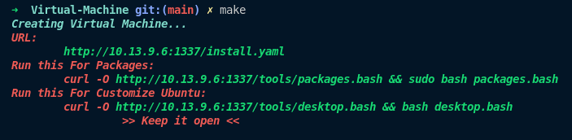

# AutoVM-Setup

A simple and customizable Bash script for setting up VirtualBox virtual machines automatically. This tool provides an easy way to create VMs with pre-defined configurations, saving time and ensuring consistency across environments.

## [Features](#features)

## [Prerequisites](#prerequisites)

## [Installation](#installation)

### Features

- Customizable memory, CPU count, and VRAM settings.
- Optional 3D acceleration and audio support.
- Configurable boot order for each VM.
- Automatically installs all popular tools and setup your desktop.

### Prerequisites

- [VirtualBox](https://www.virtualbox.org/) installed
- Bash shell (available on macOS, Linux, or Windows via WSL)
- Python3 for server hosting
- Make for run project

### Installation

#### 1- Clone this repository:

```bash
git clone https://github.com/ahmedelqori/AutoVM-Setup.git
cd AutoVM-Setup
```

#### 2- Change Env Variables:

```bash
    vim .env || code .env
    - Change all you need
```

```bash
# Name Of Your VM
    NAME=meedivo
# Size with megabytes
    SIZE=40000
# Number of cores
    CPU=10
# RAM with megabytes
    RAM=10240
# Virtual Memory with mb
    VRAM=128
# Path of your vm
    PATH=/goinfre/ael-qori
# Path of your iso
    ISO=/goinfre/ael-qori/iso/ubuntu.iso
```

#### 3- Change Yaml:

- Change Here hostname and username and put hashedpassword of your password use that https://mkpasswd.stravers.net/
  
- Here just update name with username you set before
  

#### 4- Make Project



```
    http://[your_ip]:1337/install.yaml # this url for automate installaion
```

#### 5- Make File

```bash
# use for help
        make help
# for logs
        make log
# for start server
        make server
# for create vm
        make VBOX
# for remove logs
        make clean
```

#### 6- Steps


- Use URL in Terminal where u run make of run `make SERVER` and use first link
  
  

4. install packages

- Password in make case is `password: 1`
  
- look at teminal where u run make and use the URL for packages
  
- look at teminal where u run make and use the URL for Desktop
  
- Result
  
